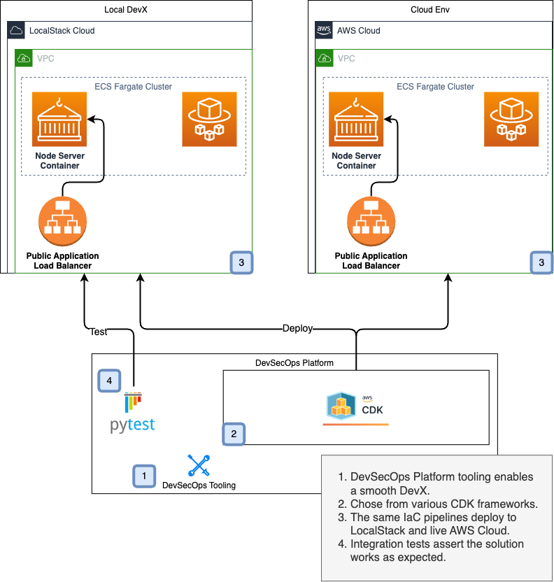

# ECS Fargate Deployment using CDK

| Key          | Value                                                                       |
| ------------ | --------------------------------------------------------------------------- |
| Environment  | LocalStack, AWS                                                             |
| Services     | ECS, Fargate, ALB, ECR, VPC                                                 |
| Integrations | AWS CDK, AWS CLI, Docker, LocalStack                                        |
| Categories   | Compute, Networking                                                         |
| Level        | Intermediate                                                                |
| Use Case     | ECS Code-Mounting, ECS Debugging                                            |
| GitHub       | [Repository link](https://github.com/localstack-samples/sample-cdk-ecs-elb) |

## Introduction

This sample demonstrates how to deploy a containerized application on AWS Fargate using the AWS Cloud Development Kit (CDK). The application infrastructure includes a VPC, ECS cluster, Fargate service, Docker image hosted in ECR, and an Application Load Balancer (ALB) for traffic routing. To test this application sample, we will demonstrate how you use LocalStack to deploy the infrastructure on your developer machine and run the application locally. We will also show how to use ECS code-mounting to apply code changes instantly without rebuilds, and how to debug the application with a Node.js debugger.

## Architecture

The following diagram shows the architecture that this sample application builds and deploys:



-   Virtual Private Cloud (VPC) that sets an isolated network environment to host AWS resources securely.
-   [Elastic Container Service (ECS)](https://docs.localstack.cloud/user-guide/aws/ecs/) to manage the deployment and scaling of containerized applications using the Fargate launch type.
-   [Elastic Load Balancer (ALB)](https://docs.localstack.cloud/user-guide/aws/elb/) to distribute incoming HTTP/S traffic across ECS tasks.

## Prerequisites

- [`localstack` CLI](https://docs.localstack.cloud/getting-started/installation/#localstack-cli) with a [`LOCALSTACK_AUTH_TOKEN`](https://docs.localstack.cloud/getting-started/auth-token/).
- [AWS CLI](https://docs.localstack.cloud/user-guide/integrations/aws-cli/) with the [`awslocal` wrapper](https://docs.localstack.cloud/user-guide/integrations/aws-cli/#localstack-aws-cli-awslocal).
- [CDK](https://docs.localstack.cloud/user-guide/integrations/aws-cdk/) with the [`cdklocal`](https://www.npmjs.com/package/aws-cdk-local) wrapper.
- [Node.js](https://nodejs.org/en/download/)
- [`make`](https://www.gnu.org/software/make/) (**optional**, but recommended for running the sample application)

## Installation

To run the sample application, you need to install the required dependencies.

First, clone the repository:

```shell
git clone https://github.com/localstack-samples/sample-cdk-ecs-elb.git
```

Then, navigate to the project directory:

```shell
cd sample-cdk-ecs-elb
```

Next, install the project dependencies by running the following command:

```shell
make install
```

## Deployment

Start LocalStack with the `LOCALSTACK_AUTH_TOKEN` pre-configured:

```shell
localstack auth set-token <your-auth-token>
localstack start
```

To deploy the sample application, run the following command:

```shell
make deploy
```

The output will be similar to the following:

```shell
Outputs:
RepoStack.MyFargateServiceLoadBalancerDNS704F6391 = lb-f6d118e8.elb.localhost.localstack.cloud
RepoStack.MyFargateServiceServiceURL4CF8398A = http://lb-f6d118e8.elb.localhost.localstack.cloud
RepoStack.localstackserviceslb = lb-f6d118e8.elb.localhost.localstack.cloud:4566
RepoStack.serviceslb = lb-f6d118e8.elb.localhost.localstack.cloud
Stack ARN:
arn:aws:cloudformation:us-east-1:000000000000:stack/RepoStack/75719142

✨  Total time: 28.73s
```

## Testing

The output of the deployment will show the URL of the load balancer. You can use this URL to access the application and verify the HTTP response:

```shell
make curl
```

The output will be similar to the following:

```shell
{"message":"Hi LocalStack!"}
```

You can run full end-to-end integration tests using the following command:

```shell
make test
```

## Use Cases

### ECS Code-Mounting

In this sample, ECS code-mounting is implemented using Docker bind mounts to enable real-time sync between your local development environment and the ECS task running in LocalStack.

The CDK configuration defines a volume that maps a local source directory (`src/app`) to a container path (`/app`) inside the ECS task. When deployed via `cdklocal`, LocalStack translates this into a Docker bind mount.

To make use of this:

-   Add a volume definition in your ECS task for the local source directory.
-   Mount that volume inside your container at the desired path.
-   Enable auto-reloading in your application (e.g., `--watch` for Node.js) to reflect code changes instantly.

This approach allows you to test and iterate faster, as demonstrated by editing a file in `src/app` and immediately seeing the updated response when invoking the ECS service.

> [!NOTE]
> LocalStack uses real Docker bind mounts to emulate AWS ECS volume behavior locally, making it ideal for fast feedback loops during development.

### ECS Debugging

This sample also demonstrates how to enable remote debugging for Node.js applications running inside ECS tasks on LocalStack. By exposing a debugging port and connecting via Visual Studio Code, you can inspect, step through, and troubleshoot your running containerized application.

The setup uses the `ECS_DOCKER_FLAGS` environment variable to configure Docker to expose the Node.js debugger on port `9229` and enable debugging with `--inspect-brk`. When LocalStack starts the ECS task, it passes these flags to the Docker container, enabling remote inspection.

> [!NOTE]
> You can either set `ECS_DOCKER_FLAGS="-e NODE_OPTIONS=--inspect-brk=0.0.0.0:9229 -p 9229:9229"` to your LocalStack startup configuration, or use a sample [`docker-compose.yml` file](devops-tooling/docker-compose.yml) provided in the repository.

To make use of this:

-   Set `ECS_DOCKER_FLAGS` to include port mapping and debugging options.
-   Restart LocalStack with this configuration.
-   Define VSCode tasks and launch configurations to wait for and attach to the remote debugger (samples available in `.vscode` directory).
-   Add breakpoints in your code and use the debugger UI to inspect execution.

Once configured, you can `curl` the ELB endpoint to trigger the application and hit breakpoints set in your VSCode editor. 

Combined with code-mounting, this setup allows live debugging without needing to rebuild Docker images, making your iteration loop faster.

## Summary

This sample application demonstrates how to provision, deploy, and test a containerized Node.js application on AWS Fargate using AWS CDK and LocalStack. It showcases the following patterns:

-   Defining and deploying core AWS resources, such as VPC, ECS, Fargate, and Elastic Load Balancer, using AWS CDK.
-   Building and pushing Docker images to Amazon ECR, and integrating them into ECS task definitions.    
-   Configuring Visual Studio Code for remote debugging of ECS tasks running in LocalStack.
-   Using bind mounts with ECS to mount code from the host filesystem into the ECS container for quick hot-reloads.
-   Utilizing `cdklocal` and `awslocal` to streamline local deployment and testing workflows.

## Learn More

- [Deep Dive tutorial into ECS hot-reloading & debugging](https://blog.localstack.cloud/developing-debugging-aws-ecs-tasks-localstack-vs-code/) (**recommended**)
- [ECS Code-Mounting](https://docs.localstack.cloud/user-guide/aws/ecs/#mounting-local-directories-for-ecs-tasks)
- [Use bind mounts with Amazon ECS](https://docs.aws.amazon.com/AmazonECS/latest/developerguide/bind-mounts.html)
- [Remote Debugging for ECS with LocalStack](https://docs.localstack.cloud/user-guide/aws/ecs/#remote-debugging)
- [Deploying AWS CDK applications with LocalStack](https://docs.localstack.cloud/user-guide/integrations/aws-cdk/)
